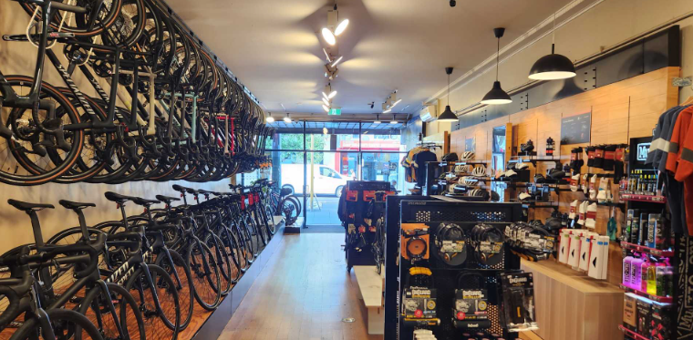
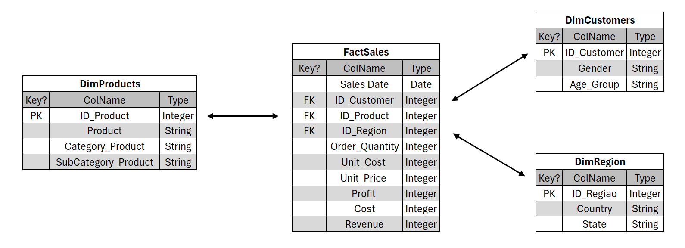

[](https://www.linkedin.com/in/pedro-bull-0363ba1a1/)
[](https://www.python.org/)

# Engenharia de Dados Aplicada: Vendas e Perfil de Clientes no Mercado de Ciclismo

Este projeto foi desenvolvido como trabalho final do módulo de Engenharia de Dados da Pós-graduação em Data Science e Advanced Analytics da PUC-RJ.

<p align="center">
  
</p>
<p align="center">
  <strong>Link original para o dataset: https://www.kaggle.com/datasets/sadiqshah/bike-sales-in-europe</strong>
</p>

<p align="center">
  <strong>Link para acessar o notebook online: https://databricks-prod-cloudfront.cloud.databricks.com/public/4027ec902e239c93eaaa8714f173bcfc/2766828811631733/3132399035759674/6919165123101387/latest.html
</p>


## 1. Objetivos

Este projeto tem como objetivo simular uma análise de dados de vendas de uma empresa fictícia do setor de ciclismo, aplicando conceitos de Engenharia de Dados, Processos de ETL e Análises de dados com SQL e Python através da plataforma de dados unificada na nuvem Databricks. A partir da construção de um data warehouse com múltiplas camadas (bronze, silver e gold), buscou-se responder a perguntas estratégicas sobre o comportamento de compra dos clientes, desempenho de produtos, lucratividade por categoria e oportunidades de expansão de mercado.

Perguntas a serem respondidas:
  - Quais tipos de produtos e/ou categoria movimentam mais o mercado?
  - Como o comportamento de compra varia entre diferentes perfis de clientes?
  - Em quais tipos de produtos a empresa deve investir?
  - Quais países representam os maiores mercados para a empresa?

## 2. Estrutura do repositório

O repositório está estruturado da seguinte forma:

```
├── data
├── images
├── notebooks
```

- Na pasta `data` a base de dados utilizada no projeto, a qual foi carregada no Databricks através do DBFS(Databricks FIle System)
- Na pasta `images` estão as imagens utilizadas neste README.
- Na pasta `notebooks` está o notebooks com o desenvolvimento do projeto. Em detalhes, temos:

## 3. Detalhes do dataset utilizado

Para o catálogo de dados, foram consideradas todos os atributos envolvidos no modelo. A coluna "Tabela" indica a qual tabela o atributo pertence na camada gold. Caso a coluna tenha sido excluida no processo de criação de tabelas da camada gold, será atribuído "-".

### Catálogo de Dados

| Coluna               | Tabela                                        | Tipo de Dado        | Descrição                                                                | Valores/Intervalos Esperados                                  |
|----------------------|-----------------------------------------------|---------------------|--------------------------------------------------------------------------|---------------------------------------------------------------|
| `Sale_Date`          | Fact_Sales                                    | DATE (yyyy-MM-dd)   | Data completa da venda                                                   | Dentro do intervalo de anos válidos; sem datas futuras        |
| `Day`                | -                                             | INT                 | Dia do mês em que a venda ocorreu                                        | 1 a 31                                                        |
| `Month_Name`         | -                                             | STRING              | Nome do mês da venda                                                     | "January" a "December"                                        |
| `Year`               | -                                             | INT                 | Ano da venda                                                             | Ex: 2011 a 2016                                               |
| `Customer_Age`       | DimCustomers                                  | INT                 | Idade do cliente no momento da compra                                    | 10 a 100 (valores fora disso podem indicar erro)              |
| `Customer_Gender`    | DimCustomers                                  | STRING              | Gênero do cliente                                                        | "M" para homens e "F" para mulheres                           |
| `Country`            | DimRegion                                     | STRING              | País onde a venda foi realizada                                          | Lista limitada (ex: "United States", "France", "Germany"...)  |
| `State`              | DimRegion                                     | STRING              | Estado ou província da venda                                             | Compatível com o país correspondente                          |
| `Product_Category`   | DimProducts                                   | STRING              | Categoria do produto vendido                                             | "Bikes", "Clothing", "Accessories"                            |
| `Sub_Category`       | DimProducts                                   | STRING              | Subcategoria do produto                                                  | Ex: "Mountain Bikes", "Socks", "Helmets"                      |
| `Product`            | DimProducts                                   | STRING              | Nome do produto                                                          | Nome único por item vendido                                   |
| `Order_Quantity`     | Fact_Sales                                    | INT                 | Quantidade de unidades vendidas                                          | > 0                                                           |
| `Unit_Cost`          | Fact_Sales                                    | FLOAT               | Custo unitário do produto                                                | > 0                                                           |
| `Unit_Price`         | Fact_Sales                                    | FLOAT               | Preço de venda unitário                                                  | > 0                                                           |
| `Profit`             | Fact_Sales                                    | FLOAT               | Lucro total da venda                                                     | Pode ser positivo ou negativo                                 |
| `Cost`               | Fact_Sales                                    | FLOAT               | Custo total da vendas                                                    | > 0                                                           |
| `Revenue`            | Fact_Sales                                    | FLOAT               | Receita total da venda                                                   | > 0                                                           |
| `ID_Product`         | Fact_Sales, DimProducts                       | BIGINT              | Identificador único do produto (chave primária em DimProducts)           | Autoincremento, valor único                                   |
| `ID_Customer`        | Fact_Sales, DimCustomers                      | BIGINT              | Identificador único do cliente (chave primária em DimCustomers)          | Autoincremento, valor único                                   |
| `ID_Region`          | Fact_Sales, DimRegion                         | BIGINT              | Identificador único da região (chave primária em DimRegion)              | Autoincremento, valor único                                   |

## 4. Modelagem de dados
O modelo de dados definido para o problema foi o **SnowFlake**. Essa escolha se deu principalmente para evitar a repetição desnecessária de dados e manter a integridade, facilidade de manutenção e a escalabilidade, pensando que esses dados tendem a crescer com o tempo, tanto em dados históricos mas também em número de produtos e regiões. Além disso, apesar de envolver mais joins que um modelo em estrela, o **SnowFlake** é eficiente em ambientes de Data Warehouse modernos, como o Databricks, que são otimizados para trabalhar com tabelas normalizadas e grandes volumes de dados.

O primeiro passo foi desenvolver a modelagem conceitual dos dados definindo a dinâmica de relacionamento das diferentes informações contidas na base de dados original. Uma particularidade desse modelo é que as informações de clientes que realizaram compra encontram-se agrupadas, ou seja, a granularidade máxima desses atributos é dada como grupos de clientes por idade e por sexo. Sendo assim, uma cidade pode conter 1 ou n grupos de clientes, assim como um grupo de clientes pode estar em uma ou n cidades. 

Em seguida, foi feita a modelagem lógica das entidades e relacionamentos, onde foram definidas quais as colunas devem estar contidas em cada tabela e quais são as chaves primárias e extrangeiras para cruzar as informações, conforme diagrama abaixo. 



Por fim, foram definidas as seguintas tabelas para a camada gold do Data Warehouse:
  - **FactSales**: Tabela fato de vendas 
  - **DimProducts**: Tabela dimensão de produtos
  - **DimCustomers**: Tabela dimensão de clientes
  - **DimRegion**: Tabela dimensão de regiões de venda

## 5. Carga de dados e ETL

A etapa de Carga compõe a carga dos dados para o Data Warehouse e o processo de ETL (Extract, Transform, Load), sendo responsável por importar, tratar e organizar os dados da base bruta, estruturando-os de maneira adequada para análises. O processo foi dividido em três camadas principais, seguindo a arquitetura em camadas (bronze, silver e gold)

**Camada bronze**: o arquivo original da fonte de dados foi carregado diretamente para o ambiente do Databricks usando PySpark. O conteúdo foi lido como um DataFrame e salvo no formato Delta Lake para garantir confiabilidade nas transações e uma melhor performance das consultas.

**Camada silver**: tratamento, limpeza, padronização e validação da qualidade dos dados presentes na camada bronze. Abaixo estão as validações de Data Quality que foram aplicadas nessa camada.

- Compatibilidade dos tipos de dados por coluna
- Verificação de Duplicatas
- Verificação de Nulos

**Camada gold**: nessa camada foram salvos os dados consolidados, agregados e modelados para consumo analítico, como já detalhado no tópico **Modelagem de Dados**.

## 6. Análise
### *Data Quality*
Considerando que os atributos de todas as tabelas desse modelo derivam da tabela original do projeto, a discussão de data quality será feita com base nas colunas da tabela original.

#### 1. Valores Nulos: 
A fonte de dados utilizada para esse projeto já estava relativamente limpa e estruturada, de modo que não existiam valores nulos em nenhuma das colunas **(etapa detalhada na camada silver)**.

#### 2. Valores Duplicados
Em relação a valores duplicados, foram encontrados 1000 registros duplicados na base de dados e a trativa escolhida foi simplesmente excluir a duplicidade de dados **(etapa detalhada na camada silver)** para não haver influência nas análises.

#### 3. Consistência
- A coluna **Sale_Date** está formatada como data (yyyy-MM-dd) e suas derivadas Day, Month_Name e Year apresentam-se no formato esperado

- As variáveis categóricas **Customer_Gender**, **Age_Group**, **Product**, **Country**, **State**, **Product_Category**, **Sub_Category** não contém erros de digitação ou inconsistências (ex: "F" vs "Female")

- Variáveis numéricas como **Order_Quantity**, **Unit_Cost**, **Unit_Price**, **Profit**, **Cost** e **Revenue** não apresentam valores negativos ou incoerentes

### Respondendo às perguntas objetivo
As consultas SQL detalhadas com valores e tabelas encontram-se no arquivo [Notebook de Análise de Dados](notebooks/MVP%20Engenharia%20de%20Dados%20-%20PedroABull.ipynb)

Uma discussão geral sobre as respostas e conclusões alcançadas no projeto será feita na etapa a seguir.

## 7. Conclusão

A partir da definição inicial dos objetivos, este projeto teve como foco analisar o desempenho de vendas de uma empresa do setor de ciclismo e entender o comportamento de compra dos clientes, com o objetivo de identificar oportunidades de crescimento e melhorias estratégicas no portfólio. Como hipótese, considerou-se que as vendas da empresa espelham o comportamento do mercado total do setor.

Com base nos dados históricos de vendas, estruturados em um modelo de dados Snowflake, serão detalhadas a seguir as respostas obtidas para as perguntas estabelecidas na fase de definição do objetivo.

1. Quais tipos de produtos e/ou categoria movimentam mais o mercado?
A análise revelou que, embora produtos das categorias Acessórios e Roupas liderem em volume de vendas, são as Bicicletas que concentram o maior faturamento. Essa distinção entre volume e receita mostra que diferentes categorias cumprem papéis distintos na estratégia comercial: enquanto roupas e acessórios promovem recorrência de compra e fidelização, as bicicletas são peças-chave no resultado financeiro geral.

2. Como o comportamento de compra varia entre diferentes perfis de clientes?
Os dados demonstram uma tendência de equilíbrio entre os gêneros no que diz respeito à compra de bicicletas, com volumes e faturamento similares entre homens e mulheres. Esse comportamento quebra paradigmas do setor e indica uma oportunidade estratégica de expansão no portfólio feminino, o qual ainda é pouco explorado no mercado como um todo.

3. Em quais tipos de produtos a empresa deve investir?
Apesar de as bicicletas representarem a maior fatia do faturamento total, sua margem percentual de lucro é relativamente baixa. Em contraste, categorias como vestuário e acessórios apresentam margens maiores e ciclo de recompra mais curto. Assim, a análise mostra que o ideal seria que a empresa equilibre seus investimentos no desenvolvimento de novos projetos, valorizando produtos de alta margem e frequência de compra, não apenas os de alto ticket.

4. Quais países representam os maiores mercados para a empresa?
Embora os maiores volumes de faturamento estejam atualmente concentrados em países como Estados Unidos e Austrália, há uma sub-representação na Europa, que é o principal mercado global do ciclismo. Isso aponta para uma grande oportunidade de expansão no continente europeu.
